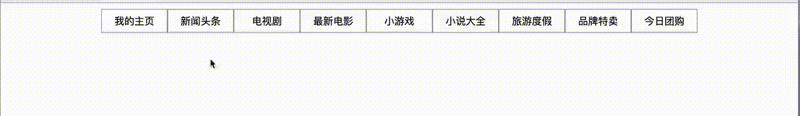

# ffm.js

*个人整理的一些js常用控件或代码。会经常维护更新*

> 包括入门时写的一些小demo，到后面用的一些技术笔记及封装的动画效果。从小到大。

*希望一起分享学习👏👏╮(￣▽￣)╭*

**补充：突然发现自己以前用css画过一些比较有趣的东西，包括一些使用css的奇淫异巧**

*还有一些实用的js/jq做的特效或插件，对于小白或者菜鸟前端小伙伴们可以star收藏*

部分demo演示：

**CSS3DBall**，利用css3D实现的一个看起来屌屌的旋转效果

---

**CSSElephant**，纯用css画的一个大象

---

**JSGame**，js实现的小游戏

---

**照片墙支持拖拽换位**

---

**导航条动画特效**

--- 

**选项卡带进度条特效**

---

**分块运动图片切换特效**，已写成插件，支持各个方向各个角度

---

###欢迎star~